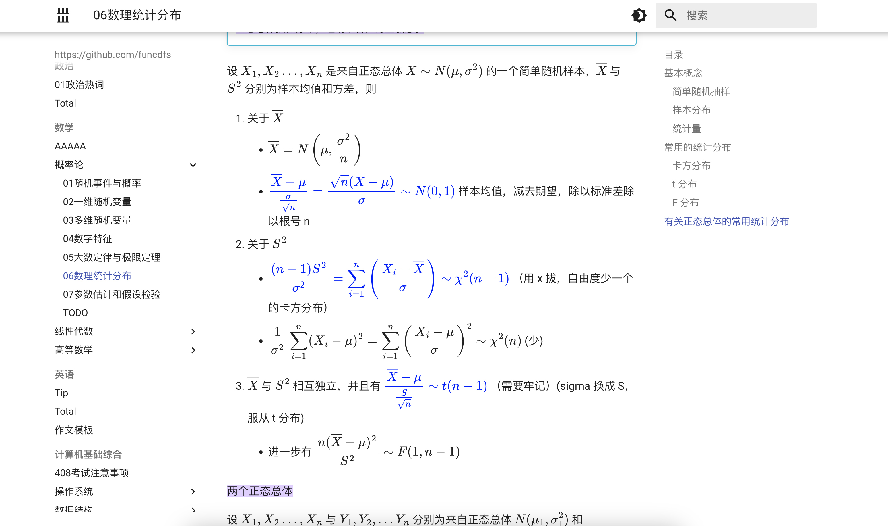

## obsidian_mkdocs_template

publish your obsidian note to a static webstie use vercel or github pages 

like this: 

## Obsidian Plugins:

### PDF Files:
- **Obsidian Annotator**: Displays PDFs in the sidebar.
- **Better Export PDF**: Improves PDF export functionality.

### UI Enhancements:
- **Obsidian Auto-Hide**: Automatically hides the sidebar.
- **Obsidian Day and Night**: Automatically switches between light and dark themes.
- **Obsidian Focus Mode**: Hides unnecessary UI elements for a distraction-free experience.
- **Recent Files Obsidian**: Displays recent files at the top.

### Markdown Files:
- **Highlightr Plugin**: Highlights text.
- **NLDates Obsidian**: Inserts dates and times easily.
- **Obsidian Image Auto Upload Plugin**: Automatically uploads images using Pigco.
- **Obsidian LaTeX Suite**: Adds support for math notes with LaTeX.
- **Obsidian Linter**: Formats markdown files for consistency.
- **Obsidian Vimrc Support**: Enables support for Vimrc in Obsidian.
- **Obsidian Auto Link Title**: Automatically generates titles for links.
